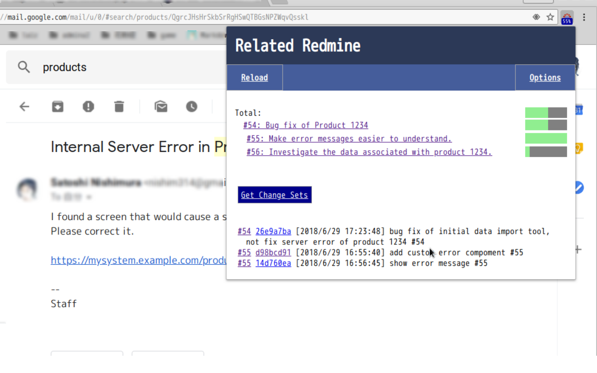

Related Redmine
===============

Show Redmine issues related by the displayed page.
You can watch the progress of your own Redmine project from wiki, mail, github with one click.

[Chrome Web Store](https://chrome.google.com/webstore/detail/related-redmine/kmgkdpnmpjmncggngjcinmkfacbgaecj)

## Setting Images

## Sample Settings

### Github

| Name               | Value         |
| ------------------ | ------------- |
| Redmine url        | https://redmine.example.com/ |
| Trigger page url   | https://github.com/user/myproject/issues |
| Trigger pattern    | issues/([0-9]+)      |
| API KEY            | xxxxxxxxxxxx (see redmine's my page)  |
| Redmine parent url | https://redmine.example.com/projects/myproject/issues.xml?status_id=*&cf_1=%value% |
| Redmine child url  | https://redmine.example.com/projects/myproject/issues.xml?status_id=*&parent_id=%value% |

`1` of cf_1 is custom field id.

### Gmail (for private ticket)

| Name               | Value         |
| ------------------ | ------------- |
| Trigger page url   | https://mail.google.com/ |
| Trigger pattern    | #[^/]+/([^/]+)      |

### Other BTS, Wiki, etc.

| Name               | Value         |
| ------------------ | ------------- |
| Trigger page url   | https://mybts.example.com/ |
| Trigger pattern    | issues/([0-9a-zA-Z]+)      |

## Logo Licence

Redmine Logo is Copyright (C) 2009 Martin Herr and is licensed under the Creative Commons Attribution-Share Alike 2.5 Generic license.
